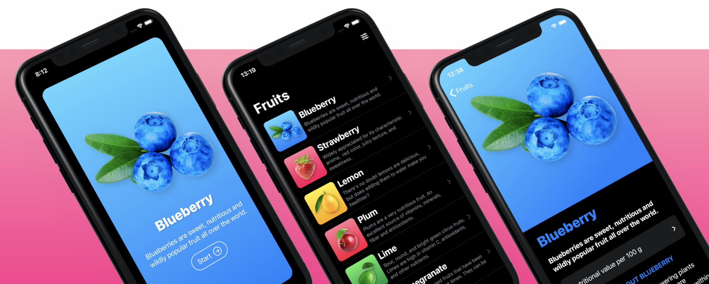

# Fructus
A simple and beautiful SwiftUI app that shows some fruits with information about them.

> This app has been made with help of [SwiftUI Masterclass 2021](https://www.udemy.com/course/swiftui-masterclass-course-ios-development-with-swift/) course by Robert Petras
